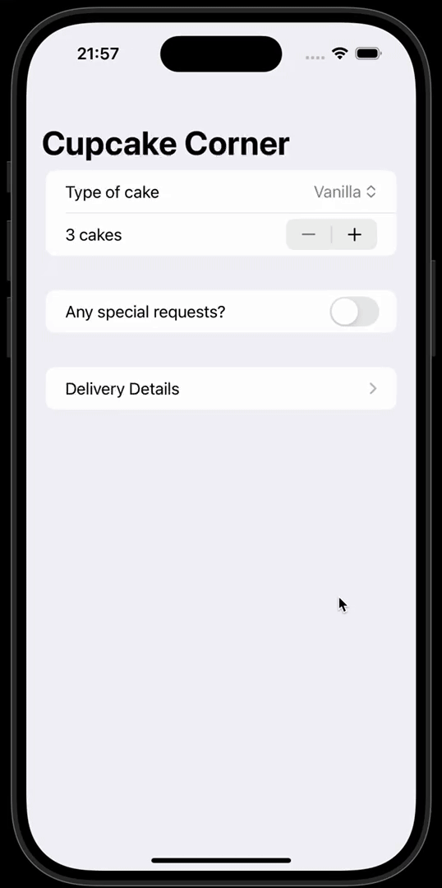

# CupcakeCorner

#### It’s always time for a yummy cupcake! Choose your favorite flavor and checkout.

## Description

#### CupcakeCorner is meant to be an app that takes care of letting the user enter their cupcake order – flavor, quantity, and special preferences.

#### It then asks for the user’s delivery details and let them proceed to checkout after showing the total cost.

#### CupcakeCorner is an app where I practiced networking calls (using ‘URLSession’ and configuring ‘URLRequest’), API usage, encoding an ‘@Observable’ object using the ‘CodingKey, protocol, and much more.

#### This goes without saying, but it’s obviously a mockup app, so you won’t be delivered any cupcakes at the end of the day, but I hope the app itself ends up stirring up your desire for a tasty cupcake. 🧁😋

### NOTE:

The App was built while attending the <a href="https://www.hackingwithswift.com/100/swiftui">100 Days of SwiftUI</a> course issued by Paul Hudson.
